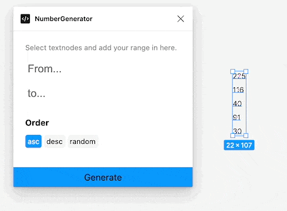
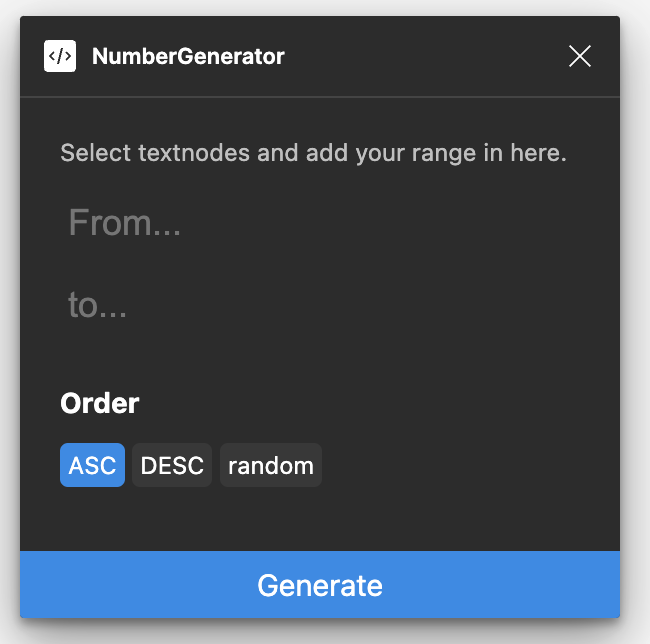

# NumberGenerator

A simple figma plugin to assign numbers to selected text fields.
Select nodes in figma and start the plugin. Only textnodes will be touched.

The plugin provides a simple UI where you can define FROM and TO range.
Additionally you can define the ordering.

If you do not like UI configuration and love to speed up using parameters you can do so.

Support for light and darkmode

## changelog

#### version 1.1

* support for system appearance (light, dark)

#### version 1

* initial version with support for UI and parameters